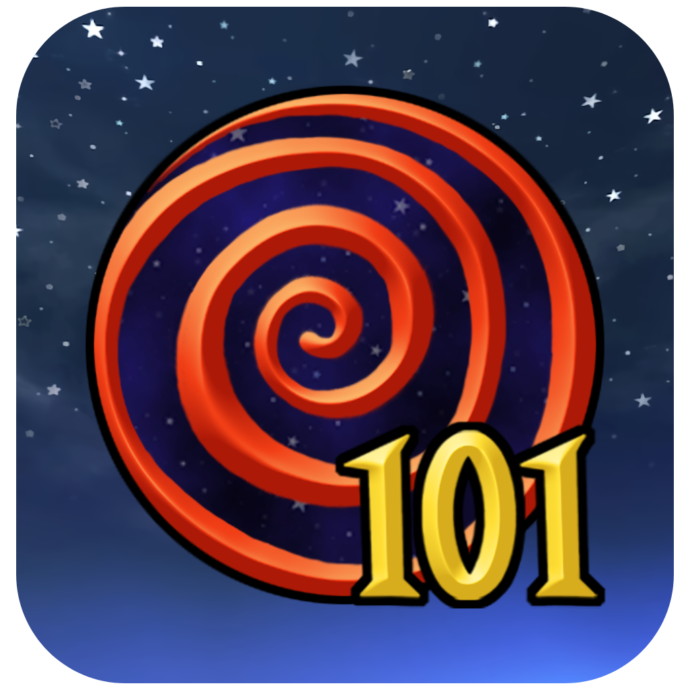

# WizWiki v0.0.1



[](https://github.com/Angle-Brackets/WizWiki/actions)
[](https://pypi.org/project/wizwiki/)
[](https://github.com/Angle-Brackets/WizWiki/blob/main/LICENSE)

A modern, high-performance, asynchronous Python library designed to scrape and query the Wizard101 Wiki with precision and ease for python 3.11+.

<br clear="both"/>

## Features

- **🚀 Asynchronous API**: Fully non-blocking I/O using `asyncio`, ensuring your applications remain responsive.
- **🛡️ Cloudflare Bypass**: Integrated with `cloudscraper` to seamlessly navigate through Wiki protection.
- **🏗️ Structured Models**: Powered by **Pydantic V2**, providing rigorous type validation and excellent IDE support.
- **💧 Lazy Loading**: Thin "View" models for quick index browsing that can be promoted to full "Resource" objects on-demand.
- **⚔️ Battle Insights**: Detailed parsing of Creature battle stats, including pips, boosts, and resistances.
- **📦 Categorized Drops**: Automatically groups gear, spells, and reagents into searchable dictionaries.

## Architecture: View & Resource Models

WizWiki uses a specialized dual-model system to maintain high performance and low memory overhead:

- **View Models (`View`)**: When a resource is returned as part of a collection (e.g., an item dropped by a boss), it is instantiated as a lightweight `View` object (like `ItemView`). These objects contain only basic identification data (name, category, url) and do not fetch the full wiki page immediately.
- **Resource Models (`Resource`)**: These are the full-fidelity objects (like `Item`, `Creature`, `Spell`). They contain all extracted fields and detailed information. 
- **Lazy Promotion**: You can "promote" any `View` into a full `Resource` by calling awaiting its `.get()` method. This seamlessly triggers a web request to parse the full page only when you explicitly need the data.

## Under The Hood

- **Engine (`cloudscraper`)**: Many components of the Wiki are protected by Cloudflare. WizWiki uses `cloudscraper` to handle these challenges automatically, wrapping them in an asynchronous execution layer to prevent event-loop blocking.
- **Parsing (`BeautifulSoup4`)**: We use specialized heuristics to parse the Wiki's complex HTML structure. Our parsing logic is encapsulated within the models themselves, allowing for specialized extraction of stats, locations, and drops.
- **Data Integrity (`Pydantic`)**: Every piece of data is validated against strict schemas. This means you get a consistent API and predictable objects every time you query a resource.

## Installation

```bash
pip install wizwiki
```

## Quick Start

```python
import asyncio
from wizwiki import WizWikiClient

async def main():
    client = WizWikiClient()
    
    # Fetch a creature (and its minions)
    creature = await client.get_creature("Malistaire Drake")
    print(f"Name: {creature.name} (Health: {creature.health})")
    
    # Access structured Battle Stats
    stats = creature.battle_stats
    print(f"Starting Pips: {stats.starting_pips}")
    print(f"Resistances: {stats.incoming_resist}")
    
    # Promote a dropped item 'View' to a full 'Resource'
    if "Hats" in creature.drops:
        hat_view = creature.drops["Hats"][0]
        hat = await hat_view.get() # Unified lazy loading
        print(f"Full Item Detail: {hat.name}")

if __name__ == "__main__":
    asyncio.run(main())
```

## Supported Categories

- **Creatures**: Stats, Drops, Locations, and Minions.
- **Spells**: School, Accuracy, and Effect parsing.
- **Items**: Gear, Decks, and Wands.
- **Reagents, Jewels, & Housing**: Full resource identification.

## CI/CD & Quality

WizWiki is tested across **Ubuntu, Windows, and macOS** using `tox` and GitHub Actions, ensuring compatibility across Python 3.9, 3.10, 3.11, and 3.12.

## License

This project is licensed under the [MIT License](LICENSE).
